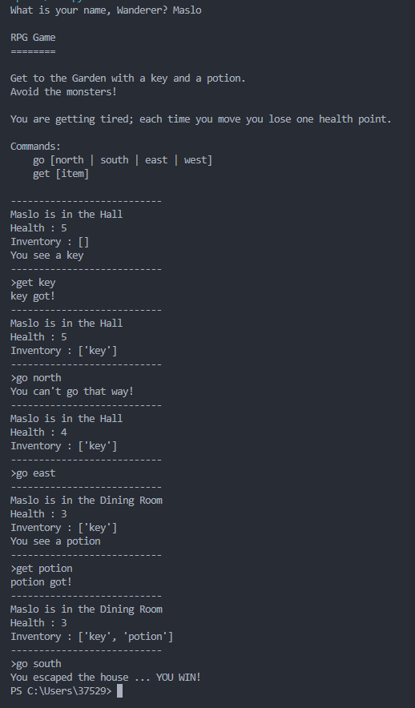

# Pet-progect_Python-RPG_Game

## 🗝️ Escape the Haunted House — text RPG
A small text adventure game in which the player must escape from a mysterious house by collecting the necessary items and avoiding monsters. The goal is to reach the garden with the key and the potion before running out of health.

## 🎮 Game mechanics
# Control via commands:
- go [north | south | east | west] — move
- get [item] — pick up an item
# Health loss: with each step the player loses 1 unit of health
# Victory: if the player has the key and the potion, he can escape by finding the exit
# Inventory: current health and a list of picked up items are displayed

## Screenshots

